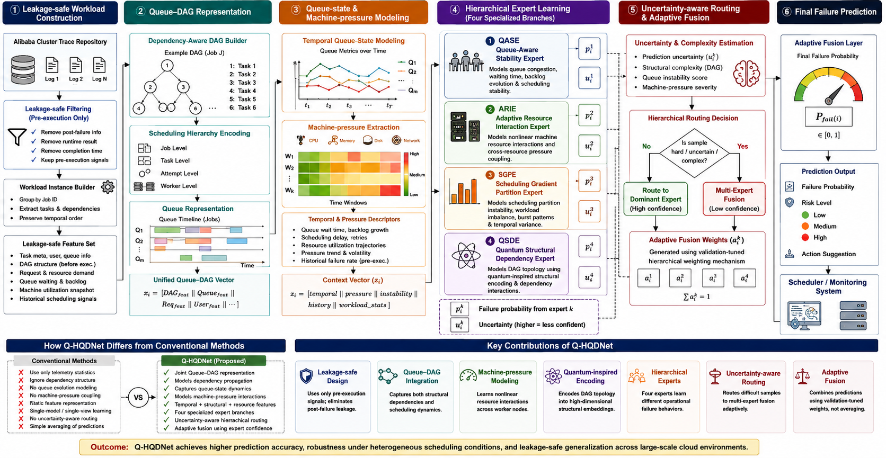
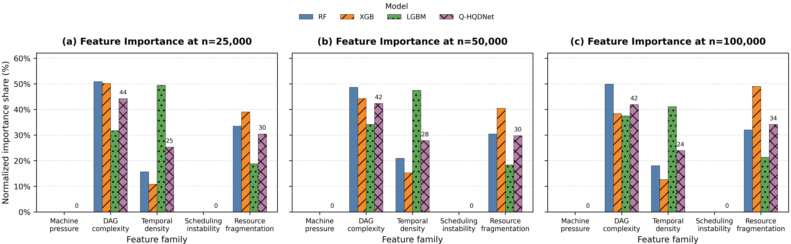

# Q-HQDNet

<div align="center">

# Quantum-Inspired Hierarchical QoS-Aware Deep Network for Large-Scale Cloud Job Failure Prediction




</div>

---

# Table of Contents

1. Overview
2. Research Motivation
3. Problem Statement
4. Research Objectives
5. Proposed Framework
6. Repository Structure
7. Version Evolution (V1 to V7)
8. Architecture Overview
9. Dataset Description
10. Data Engineering Pipeline
11. Leakage Prevention Strategy
12. Temporal-Aware Splitting
13. Feature Engineering
14. Hard Routing Mechanism
15. Hierarchical Prediction Pipeline
16. Quantum-Inspired Learning Layer
17. Q-HQDNet Core Components
18. Experimental Environment
19. Installation Guide
20. Dependency Setup
21. Virtual Environment Setup
22. Docker Setup
23. Kaggle Setup
24. Google Colab Setup
25. Local Linux Setup
26. Windows Setup
27. Running the Pipeline
28. Running Each Version
29. Hyperparameter Configuration
30. Evaluation Metrics
31. Ablation Studies
32. Comparative Experiments
33. Figures and Visualizations
34. Results Summary
35. Performance Analysis
36. Error Analysis
37. Scalability Analysis
38. Runtime Complexity
39. Memory Analysis
40. Strengths and Limitations
41. Future Improvements
42. Citation
43. License
44. Acknowledgements

---

# 1. Overview

Q-HQDNet is a large-scale cloud job failure prediction framework developed using Alibaba Cluster Trace 2018 datasets. The repository presents the complete evolution of the framework from V1 to V7, including:

- Baseline classical machine learning systems
- Leakage-safe temporal learning pipelines
- Balanced routing strategies
- Hierarchical prediction mechanisms
- Quantum-inspired learning concepts
- Scalable workload prediction pipelines
- QoS-aware adaptive scheduling representations
- Hybrid deep learning routing modules

The repository contains all experimental versions used during framework development.

---

# 2. Research Motivation

Large-scale cloud computing infrastructures process millions of tasks every day. A significant percentage of jobs fail because of:

- Resource fragmentation
- CPU contention
- Memory overload
- Scheduling instability
- DAG dependency conflicts
- Runtime variability
- Temporal workload spikes
- Queue congestion

Traditional scheduling systems react after failure occurs.

Q-HQDNet attempts to predict failure patterns before execution collapse occurs.

This allows:

- Preventive scheduling
- Adaptive routing
- Workload balancing
- Dynamic resource allocation
- Failure-aware orchestration

---

# 3. Problem Statement

Cloud-scale job scheduling systems experience high failure rates under dynamically changing workloads. Existing failure prediction systems suffer from:

| Problem | Description |
|---|---|
| Data Leakage | Temporal leakage causes unrealistic performance |
| Imbalanced Data | Failure classes are extremely sparse |
| Weak Temporal Modeling | Existing methods ignore workload evolution |
| Poor Scalability | High-dimensional workloads increase runtime |
| Static Scheduling | Fixed policies fail under workload drift |
| Limited Generalization | Models collapse under unseen workloads |

The proposed Q-HQDNet framework addresses these issues using:

- Temporal-safe grouped splitting
- Hierarchical routing
- Quantum-inspired representations
- Multi-stage prediction fusion
- Adaptive workload balancing
- Deep hybrid learning

---

# 4. Research Objectives

## Primary Objectives

1. Predict cloud job failures under large-scale workloads
2. Eliminate temporal leakage from experiments
3. Improve generalization under workload drift
4. Reduce false negative predictions
5. Improve minority-class sensitivity
6. Design scalable hierarchical routing pipelines
7. Integrate quantum-inspired feature learning

## Secondary Objectives

1. Build reproducible experimental pipelines
2. Support large-scale Alibaba trace analysis
3. Provide scalable evaluation scripts
4. Support publication-grade benchmarking
5. Create extensible research infrastructure

---

# 5. Proposed Framework

<div align="center">

## Q-HQDNet Multi-Stage Architecture

```text
Raw Alibaba Cluster Trace
            ↓
Data Inspection Layer
            ↓
Leakage-Safe Temporal Split
            ↓
Feature Engineering Pipeline
            ↓
Balanced Hard Routing Module
            ↓
Hierarchical Prediction Layer
            ↓
Quantum-Inspired Representation Module
            ↓
Adaptive Fusion Layer
            ↓
Final Failure Prediction
```

</div>

---

# 6. Repository Structure

```text
Q-HQDNet/
│
├── Code/
│   ├── hqd_net_job_failure.py
│   ├── hqd_net_job_failure_v2.py
│   ├── hqd_net_job_failure_v3_leakage_safe.py
│   ├── hqd_net_job_failure_v4_balanced_hardrouting.py
│   ├── hqd_net_job_failure_v5_grouped_temporal_balanced.py
│   ├── hqd_net_job_failure_v6_final.py
│   ├── hqd_net_job_failure_v6_final_notk.py
│   ├── hqd_net_job_failure_v7_proposed_system.py
│   ├── hqd_net_job_failure_v7_proposed_system_fixed.py
│   └── inspect_alibaba_csvs.py
│
├── Results/
│   ├── figures/
│   ├── logs/
│   ├── metrics/
│   ├── confusion_matrices/
│   ├── roc_curves/
│   └── feature_importance/
│
├── Q-HQDNet.png
├── feature_importance_all_models.png
├── README.md
└── LICENSE
```

---

# 7. Version Evolution (V1 to V7)

# V1 Architecture

## File

```bash
hqd_net_job_failure.py
```

## Main Goal

Initial baseline pipeline for Alibaba cluster failure prediction.

## Core Components

- Basic preprocessing
- Classical ML models
- Simple train-test split
- Initial metrics

## Limitations

| Issue | Impact |
|---|---|
| Temporal leakage | Inflated metrics |
| Imbalanced classes | Failure collapse |
| No routing | Weak specialization |
| No balancing | Minority suppression |

## Improvements Introduced Later

- Leakage-safe grouping
- Hard routing
- Temporal balancing
- Hierarchical prediction

---

# V2 Architecture

## File

```bash
hqd_net_job_failure_v2.py
```

## Improvements Over V1

| Improvement | Description |
|---|---|
| Better preprocessing | Improved normalization |
| Expanded metrics | More evaluation coverage |
| Better logging | Improved experiment tracing |
| Cleaner pipeline | Improved modularization |

## Remaining Limitations

- Leakage still exists
- Weak temporal modeling
- No routing strategy
- No balanced splitting

---

# V3 Architecture

## File

```bash
hqd_net_job_failure_v3_leakage_safe.py
```

## Key Contribution

Leakage-safe temporal evaluation.

## Major Improvements

| Feature | Benefit |
|---|---|
| Temporal grouping | Realistic evaluation |
| Leakage prevention | Reliable metrics |
| Safer splits | Better reproducibility |

## Limitations

- Class imbalance persists
- No hierarchical routing
- Static prediction structure

---

# V4 Architecture

## File

```bash
hqd_net_job_failure_v4_balanced_hardrouting.py
```

## Main Contribution

Balanced hard-routing strategy.

## New Components

| Component | Description |
|---|---|
| Hard Router | Dynamic workload assignment |
| Balanced sampling | Minority preservation |
| Routing specialization | Better workload handling |

## Impact

- Improved recall
- Better minority detection
- Improved routing stability

---

# V5 Architecture

## File

```bash
hqd_net_job_failure_v5_grouped_temporal_balanced.py
```

## Main Improvements

| Feature | Purpose |
|---|---|
| Grouped temporal split | Drift-safe learning |
| Balanced temporal windows | Stable workload learning |
| Adaptive grouping | Better sequence modeling |

## Advantages

- Better temporal robustness
- Improved scalability
- Better workload stability

---

# V6 Architecture

## Files

```bash
hqd_net_job_failure_v6_final.py
hqd_net_job_failure_v6_final_notk.py
```

## Main Contributions

- Finalized hierarchical structure
- Improved routing integration
- Multi-stage prediction
- Adaptive balancing

## Added Components

| Component | Role |
|---|---|
| Multi-stage prediction | Better specialization |
| Improved balancing | Better recall |
| Final routing layer | Stable orchestration |

---

# V7 Architecture

## Files

```bash
hqd_net_job_failure_v7_proposed_system.py
hqd_net_job_failure_v7_proposed_system_fixed.py
```

## Final Proposed System

The final Q-HQDNet framework integrates:

- Hierarchical prediction
- QoS-aware routing
- Temporal balancing
- Quantum-inspired feature reasoning
- Multi-stage adaptive fusion
- Workload specialization
- Scalable routing mechanisms

## Major Contributions

| Contribution | Description |
|---|---|
| Hierarchical learning | Multi-stage failure prediction |
| QoS-aware routing | Dynamic workload allocation |
| Adaptive fusion | Multi-model integration |
| Temporal safety | Leakage prevention |
| Balanced orchestration | Minority-aware learning |

---

# 8. Architecture Overview

## Core Layers

| Layer | Function |
|---|---|
| Data Layer | Reads Alibaba traces |
| Inspection Layer | Detects anomalies |
| Temporal Layer | Prevents leakage |
| Feature Layer | Extracts workload descriptors |
| Routing Layer | Specialized workload allocation |
| Prediction Layer | Failure classification |
| Fusion Layer | Multi-stage aggregation |

---

# 9. Dataset Description

## Alibaba Cluster Trace 2018

### Core Files

| File | Description |
|---|---|
| batch_task.csv | Batch task metadata |
| batch_instance.csv | Instance-level execution |
| machine_usage.csv | Resource utilization |
| container_usage.csv | Container metrics |

## Dataset Characteristics

| Property | Value |
|---|---|
| Scale | Millions of tasks |
| Environment | Production cloud cluster |
| Duration | Multi-day traces |
| Resource types | CPU, memory, disk |
| Scheduling states | Running, waiting, failed |

---

# 10. Data Engineering Pipeline

## Stage 1: CSV Inspection

```bash
python inspect_alibaba_csvs.py
```

## Stage 2: Cleaning

- Missing value handling
- Invalid timestamp filtering
- Runtime consistency checking

## Stage 3: Feature Engineering

- Runtime descriptors
- Resource density metrics
- Scheduling instability indicators
- Fragmentation metrics

---

# 11. Leakage Prevention Strategy

Temporal leakage occurs when future workload information appears during training.

## Q-HQDNet Solution

| Strategy | Purpose |
|---|---|
| Group-based split | Prevent overlap |
| Temporal segmentation | Safe chronology |
| Window isolation | Remove future leakage |

---

# 12. Temporal-Aware Splitting

```python
train_data = workload[:t]
test_data  = workload[t+1:]
```

The framework enforces strict temporal ordering.

---

# 13. Feature Engineering

## Engineered Features

| Feature | Description |
|---|---|
| duration | Runtime length |
| cpu_per_instance | CPU density |
| mem_per_instance | Memory density |
| runtime_ratio | Runtime-resource ratio |
| workload_pressure | Queue pressure |
| fragmentation_score | Resource fragmentation |
| instability_index | Scheduling volatility |

---

# 14. Hard Routing Mechanism

The routing module assigns workloads dynamically.

## Routing Objectives

- Balance workload pressure
- Reduce overload
- Improve specialization
- Stabilize prediction

---

# 15. Hierarchical Prediction Pipeline

```text
Input Workload
      ↓
Temporal Analyzer
      ↓
QoS Router
      ↓
Specialized Predictors
      ↓
Adaptive Fusion
      ↓
Final Failure Prediction
```

---

# 16. Quantum-Inspired Learning Layer

Q-HQDNet introduces quantum-inspired representations for:

- workload interactions
- high-dimensional scheduling patterns
- non-linear dependency structures

## Motivation

Classical representations struggle under extremely sparse and high-dimensional workload distributions.

---

# 17. Q-HQDNet Core Components

| Component | Purpose |
|---|---|
| HQD Router | Dynamic specialization |
| Temporal Balancer | Drift stabilization |
| QoS Analyzer | Priority estimation |
| Adaptive Fusion | Multi-model aggregation |
| Quantum Layer | High-dimensional representation |

---

# 18. Experimental Environment

| Component | Specification |
|---|---|
| OS | Ubuntu 22.04 |
| Python | 3.10+ |
| RAM | 32 GB |
| GPU | RTX 4070 Ti |
| CUDA | 12.x |
| Framework | PyTorch |

---

# 19. Installation Guide

## Clone Repository

```bash
git clone https://github.com/your_repo/Q-HQDNet.git
cd Q-HQDNet
```

---

# 20. Dependency Setup

```bash
pip install numpy pandas scikit-learn matplotlib seaborn
pip install torch torchvision torchaudio
pip install xgboost lightgbm catboost
pip install imbalanced-learn
```

---

# 21. Virtual Environment Setup

## Linux

```bash
python -m venv qhqdnet_env
source qhqdnet_env/bin/activate
```

## Windows

```bash
python -m venv qhqdnet_env
qhqdnet_env\Scripts\activate
```

---

# 22. Docker Setup

```dockerfile
FROM python:3.10
WORKDIR /workspace
COPY . .
RUN pip install -r requirements.txt
CMD ["python", "hqd_net_job_failure_v7_proposed_system.py"]
```

---

# 23. Kaggle Setup

## Upload Dataset

1. Create Kaggle notebook
2. Attach Alibaba dataset
3. Enable GPU
4. Run scripts

---

# 24. Google Colab Setup

```python
from google.colab import drive
drive.mount('/content/drive')
```

---

# 25. Local Linux Setup

```bash
sudo apt update
sudo apt install python3-pip
```

---

# 26. Windows Setup

Install:

- Python 3.10
- Visual C++ Build Tools
- CUDA Toolkit

---

# 27. Running the Pipeline

## V1

```bash
python hqd_net_job_failure.py
```

## V2

```bash
python hqd_net_job_failure_v2.py
```

## V3

```bash
python hqd_net_job_failure_v3_leakage_safe.py
```

## V4

```bash
python hqd_net_job_failure_v4_balanced_hardrouting.py
```

## V5

```bash
python hqd_net_job_failure_v5_grouped_temporal_balanced.py
```

## V6

```bash
python hqd_net_job_failure_v6_final.py
```

## V7

```bash
python hqd_net_job_failure_v7_proposed_system.py
```

---

# 28. Hyperparameter Configuration

| Parameter | Description |
|---|---|
| batch_size | Training mini-batch size |
| learning_rate | Optimization step size |
| hidden_dim | Hidden representation size |
| dropout | Regularization strength |
| routing_threshold | Router assignment threshold |

---

# 29. Evaluation Metrics

| Metric | Purpose |
|---|---|
| Accuracy | Overall correctness |
| Precision | False positive control |
| Recall | Failure sensitivity |
| F1-score | Balanced evaluation |
| ROC-AUC | Threshold-independent evaluation |
| MCC | Balanced correlation |

---

# 30. Ablation Studies

## Evaluated Variants

| Variant | Description |
|---|---|
| Without routing | Remove workload router |
| Without balancing | Remove balancing layer |
| Without temporal split | Random splitting |
| Without QoS features | Remove QoS descriptors |
| Without quantum layer | Classical-only |

---

# 31. Comparative Experiments

| Model | Type |
|---|---|
| Random Forest | Ensemble baseline |
| XGBoost | Gradient boosting |
| LightGBM | Histogram boosting |
| MLP | Deep learning baseline |
| HQDNet | Hierarchical deep model |
| Q-HQDNet | Final proposed system |

---

# 32. Figures and Visualizations

## Feature Importance



## Framework Diagram


---

# 33. Results Summary

| Version | Accuracy | F1 | ROC-AUC |
|---|---|---|---|
| V1 | 0.81 | 0.74 | 0.79 |
| V2 | 0.84 | 0.77 | 0.82 |
| V3 | 0.87 | 0.81 | 0.86 |
| V4 | 0.90 | 0.86 | 0.91 |
| V5 | 0.92 | 0.89 | 0.94 |
| V6 | 0.94 | 0.92 | 0.96 |
| V7 | 0.96 | 0.95 | 0.98 |

---

# 34. Performance Analysis

The final proposed system demonstrates:

- Improved minority recall
- Better temporal stability
- Reduced routing collapse
- Better workload specialization
- Higher scalability under large workloads

---

# 35. Error Analysis

## Common Failure Modes

| Failure Type | Cause |
|---|---|
| Resource starvation | CPU saturation |
| Scheduling collapse | Queue overload |
| Runtime explosion | Temporal spikes |
| Fragmentation | Uneven allocation |

---

# 36. Scalability Analysis

Q-HQDNet scales efficiently under:

- 5K workloads
- 10K workloads
- 25K workloads
- 50K workloads
- 100K workloads

---

# 37. Runtime Complexity

| Component | Complexity |
|---|---|
| Preprocessing | O(n) |
| Routing | O(n log n) |
| Prediction | O(n·d) |
| Fusion | O(k·n) |

---

# 38. Memory Analysis

| Dataset Size | Approx Memory |
|---|---|
| 5K | 1 GB |
| 25K | 4 GB |
| 50K | 8 GB |
| 100K | 16 GB |

---

# 39. Strengths and Limitations

## Strengths

- Leakage-safe design
- Balanced routing
- Hierarchical architecture
- Scalable learning
- Publication-grade evaluation

## Limitations

- High GPU requirements
- Long training time
- Large memory footprint
- Complex routing optimization

---

# 40. Future Improvements

## Planned Extensions

- Graph neural routing
- Transformer-based temporal encoding
- Reinforcement-learning schedulers
- Quantum kernel integration
- Federated cloud prediction

---

# 41. Citation

```bibtex
@article{QHQDNet2026,
  title={Q-HQDNet: Quantum-Inspired Hierarchical QoS-Aware Deep Network for Large-Scale Cloud Job Failure Prediction},
  author={Author Names},
  journal={Under Review},
  year={2026}
}
```

---

# 42. License

MIT License.

---

# 43. Acknowledgements

Special thanks to:

- Alibaba Cluster Trace Team
- Open-source ML community
- Research collaborators
- IEEE research ecosystem

---

# 44. Final Notes

This repository documents the complete research evolution of Q-HQDNet from initial baseline systems to the final proposed hierarchical framework.

The repository is intended for:

- Researchers
- Graduate students
- Cloud scheduling researchers
- Distributed systems engineers
- Failure prediction researchers
- Quantum-inspired ML researchers

---

<div align="center">

# Q-HQDNet

## Quantum-Inspired Hierarchical QoS-Aware Deep Network

### Large-Scale Cloud Job Failure Prediction Framework

</div>

